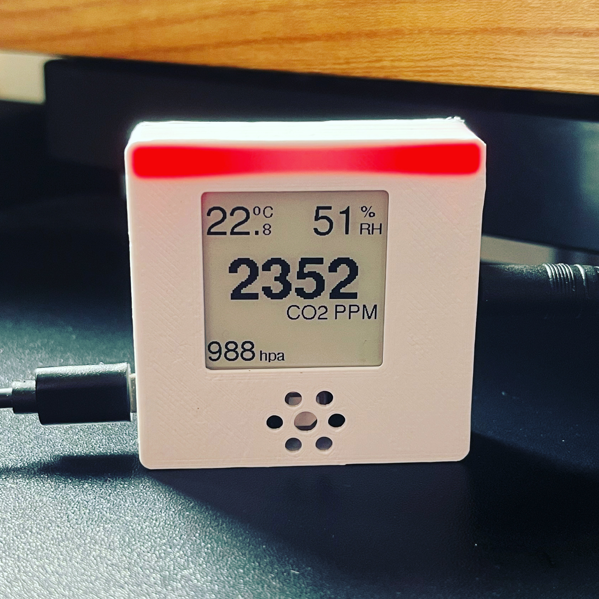
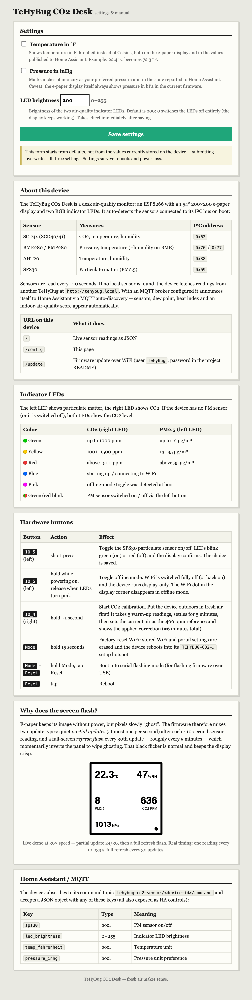
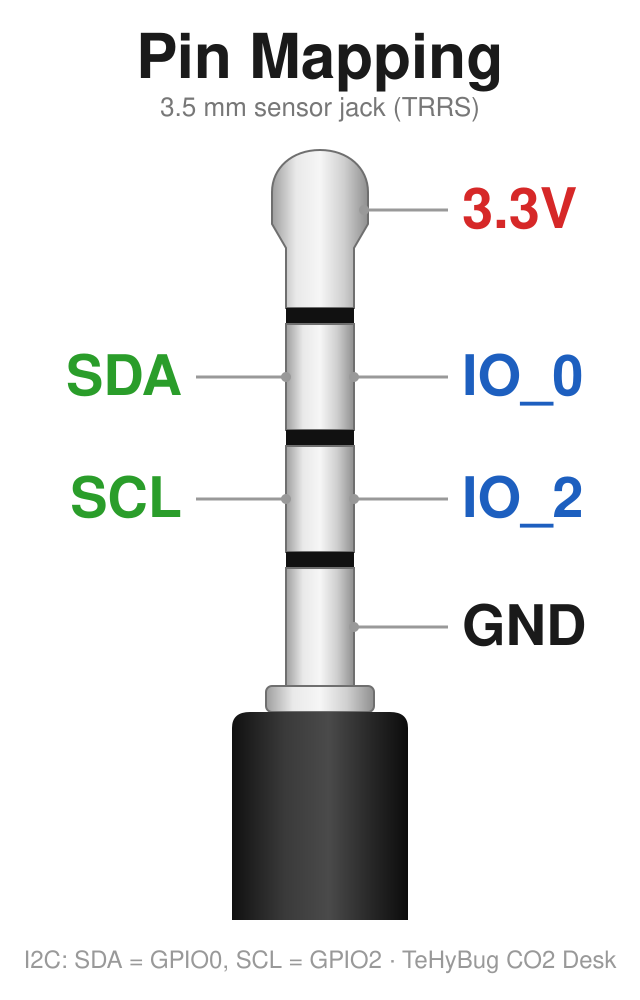

<a href="https://www.buymeacoffee.com/gumslone" target="_blank"></a>

# TeHyBug CO2 Desk Sensor Firmware



TeHyBug firmware for SCD4X and Senseair S8 sensor with E-Ink Display and additional external sensors like AHT10 and BMX280.

Order your device here: https://www.tindie.com/products/30173/

## Features:
- 152x152 or 200x200 E-Paper Display
- RGB indication for normal (green), medium (yellow) and high (red) CO2 level
- HomeAssistant (https://www.home-assistant.io/) MQTT Autodiscovery mode (just provide the mqtt brocker ip and the device will appear in your HA)
- Web Server for OTA Updates, simply upload new firmware versions via web interface
- Web Server that serves the sensor data in Json Format
- Possible to turn off WIFI and work in offline display only mode (Hit reset and hold the Button IO_5 when you see the TeHyBug logo, once the LED turns purple, release the button). To find out that the wifi is on, there will be a small dot on the right side of the display with sensordata
- Hold the mode button for 15 seconds to factory reset your device and delete  the wifi configuration

## How to calibrate the CO2 sensor
SCD4X sensor has an automatic calibration and usually doesnt need to be calibrated.
Only temperature and humidity of SD4X requires a calibration. To have a more precise temperature and humidity measurements with additional barometric air pressure, its recommended to use the external tehybug universal sensor.

## Building from source

With [arduino-cli](https://arduino.github.io/arduino-cli/) and the esp8266 core installed:

```
./build.sh            # release build (quiet serial) for esp8285, nodemcuv2, d1_mini
./build.sh debug      # verbose serial logging (DEBUG_ENABLED=1)
./build.sh all        # both
```

Every build runs for both e-paper panel variants: **200x200** (1.50" GxDEPG0150BN2, the common one) and **152x152** (1.54" GxDEPG0154BxS800FxX_BW). Binaries land in `build/<board>/<mode>/<display>/`; a release build also refreshes the prebuilt `tehybug_co2_desk_firmware.ino.esp8285.bin` (200x200 variant). GitHub releases carry all variants named `tehybug_co2_desk_firmware.<board>.<display>.<mode>.bin`.

## How to program/flash the board
To flash firmware use the .esp8285.bin file.
For flashing and programming you can use ARDUINO IDE, select there generic ESP8285 board.
Also you can use the [ESPTool](https://github.com/espressif/esptool) to flash binaries to the board or other tools which are described at: https://nodemcu.readthedocs.io/en/latest/flash/

## Upload new firmware via web interface

To update the firmware from OTA WebInterface open http://tehybug.local/update in your browser, if this doesnt work, try to find out its IP from your router admin menu or use any local network ip scanner app for your mobile phone to get the device ip and then open http://<ip_address<ip address>>/update with your browser.

## Built-in settings & manual page

Open http://tehybug.local/config (or `http://<ip address>/config`) in your browser. Besides the settings (temperature unit, pressure unit, LED brightness) the page documents the device itself: LED color thresholds, a hardware-button cheat sheet, a live demo of the e-paper refresh pattern and the MQTT command reference.




For the update page you will have to provide a username and a password:
  
Username: TeHyBug
  
Password: FreshAirMakesSense

## Calibration
SCD40 and SCD41 come precalibrated and usually don't require any calibration, but in some uncommon cases you can force the sensor calibration.
1. Put your device outdoors to fresh air.
2. Hold the IO_4 Button pressed for about 1 second, then release it.
3. There will be a screen message that the calibration has started. (no message? then retry with step 2)
4. Wait until the display reports the calibration result (the routine takes about 6 minutes: a few warm-up readings, a 5-minute settling period, then the sensor is set to the outdoor 400 ppm reference).
 
## Buttons


### Mode Button

- hold the Mode button for 15 seconds to do a factory reset (works only with already configured devices)
- hold the Mode button and hit the Reset button to boot the device into a flashing mode (in case you want to flash a firmware manually via USB)

### Reset Button

 - hit it to reboot the device, works in combination with other buttons
 
### IO_5 Button

- toggles offline or online mode, hold the IO_5 button and hit the reset button, keep holding the IO_5 Button until the led becomes purple. This will toggle the online or an offline (no wifi connection) mode. In online mode your device can serve sensor data through MQTT with HomeAssistant auto discover.

### IO_4 Button

- hold for about 1 second to force calibration (see the Calibration section)

## Pinmapping
  


## HomeAssistant


## IOS Scriptable widget

The script is available here: https://gist.github.com/gumslone/22fb0bd529c787cc91c8f6e64f240749

## 3D Printed enclosure
TeHyBug Mini CO2 enclosure for 3D printing is available on Thingiverse: https://www.thingiverse.com/thing:5999218

An enclosure for a larger version of the sensor is in design process and will be published soon.

## Configuration first steps
- Connect external sensor to the board 3,5mm audio jack connector.
- Connect the power supply to micro USB port
- TeHyBug will boot, the led will turn blue and the logo will appear on the display (if display is available)
- Connect to a TeHyBug wifi network like the image below
- 
- open http://192.168.4.1/ in your browser, and click the configuration button
- 

## Articles:
- https://blog.tindie.com/2022/09/affordable-portable-co2-measurments/
- https://www.cnx-software.com/2022/09/06/sensirion-scd40-co2-sensor-units-for-makers-m5stack-unit-co2-and-tehybug-esp8285-device/?fbclid=IwAR1-4947I3m_kvyDzOXxJrO1CapwlxPDFNaJKcEdamvzNgL3oAj3siubAzQ
- https://blog.tehybug.com/index.php/2022/08/28/tehybug-co2-mini-sensor/
